# Первое самостоятельное задание с пары

1) Установить пакеты samba bind bind-utils и любой питоновский модуль
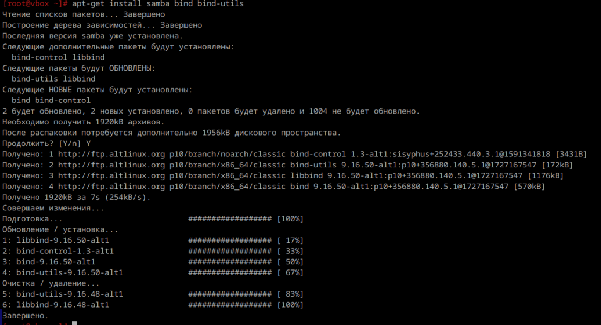
и установила python3
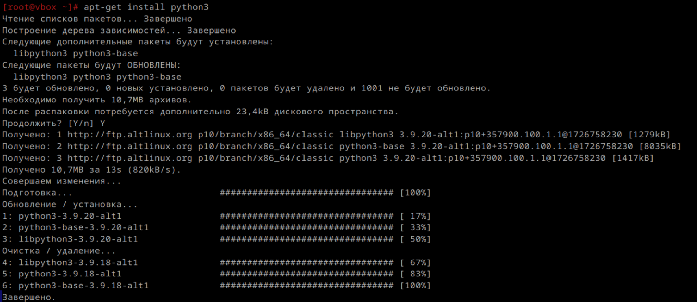

2) Вывести:
    2.1) Версию
    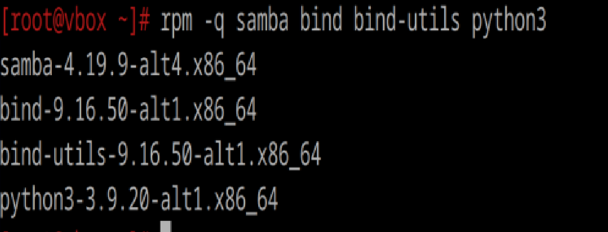

    2.2) Файлы пренадлежащие пакету
    cамба:
    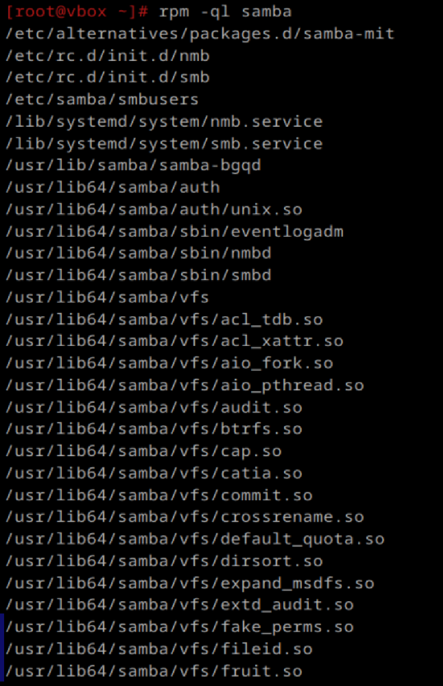
    у нее очень много файлов, поэтому все не стану загружать

    bind:
    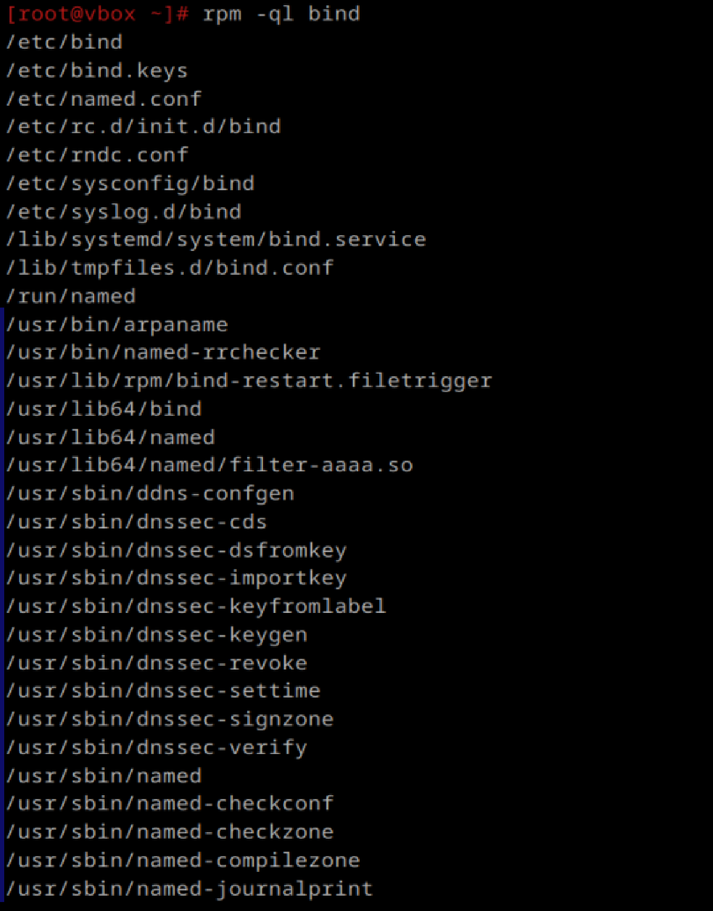
    аналогично, что и с самбой

    bind-utils и python3:
    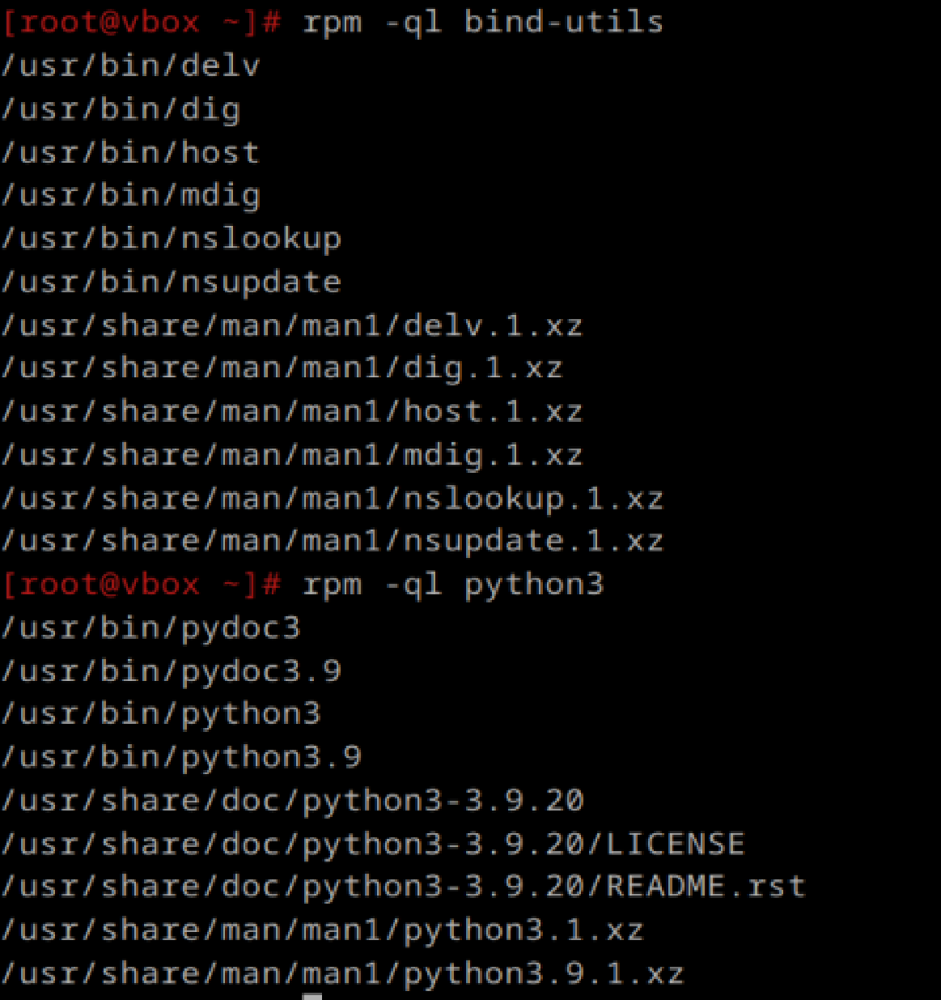

    2.3) Зависимости
    самба:
    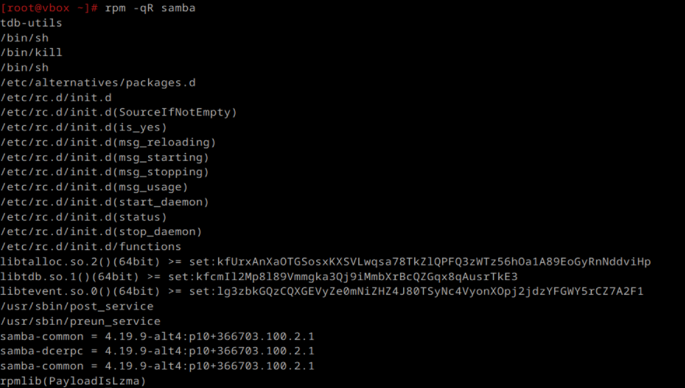

    bind:
    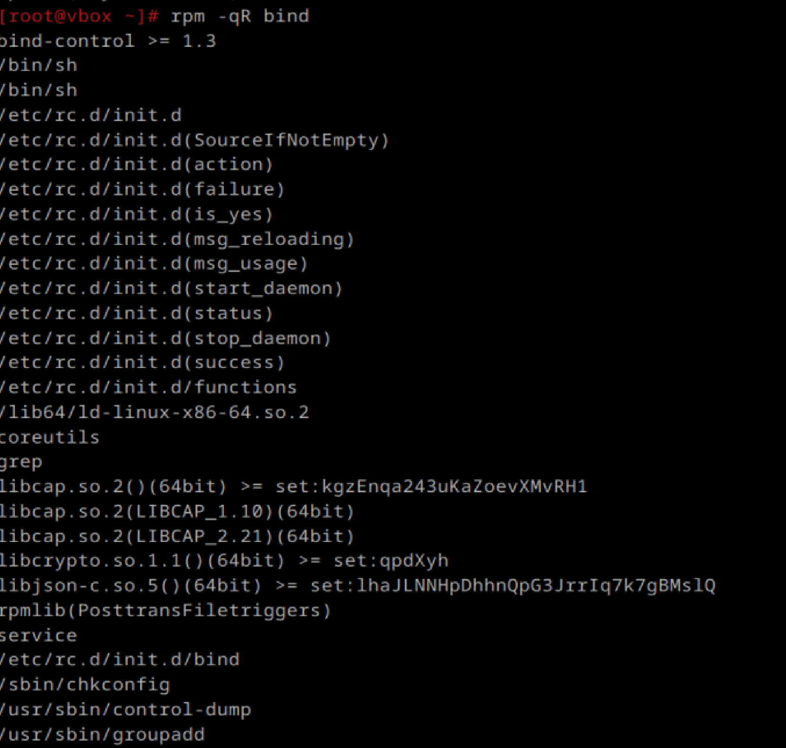
    все не стала показывать

    bind-utils и python3:
    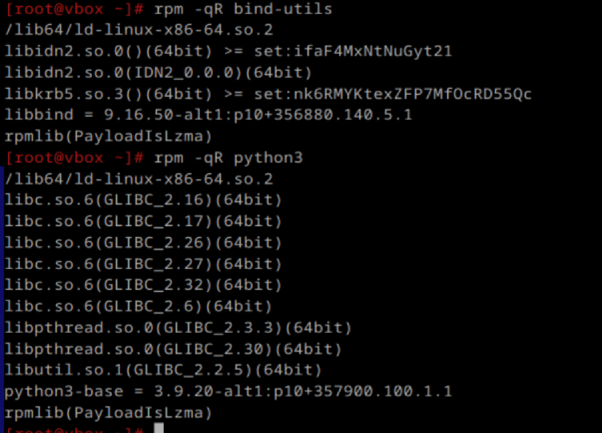

3) Проверить службы установленных пакетов, еси не запущенны запустить, добавить в автозагрузку
    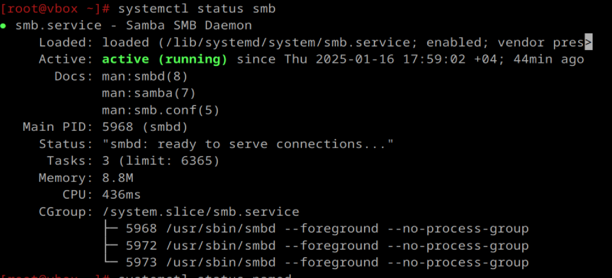
    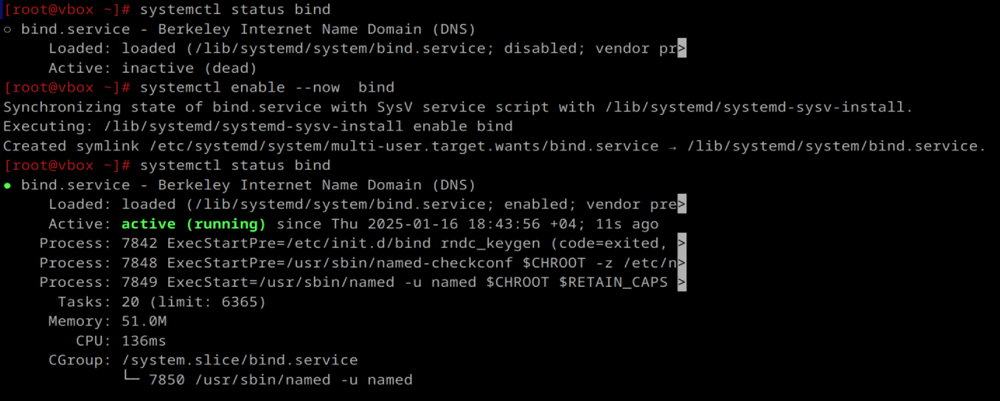

    3.1) можно ли включить и добавить в автозагрузку одной командой?
    systemctl enable --now [пакет]

4) Найти и вывести конфигурационные файлы пакетов у которых они есть
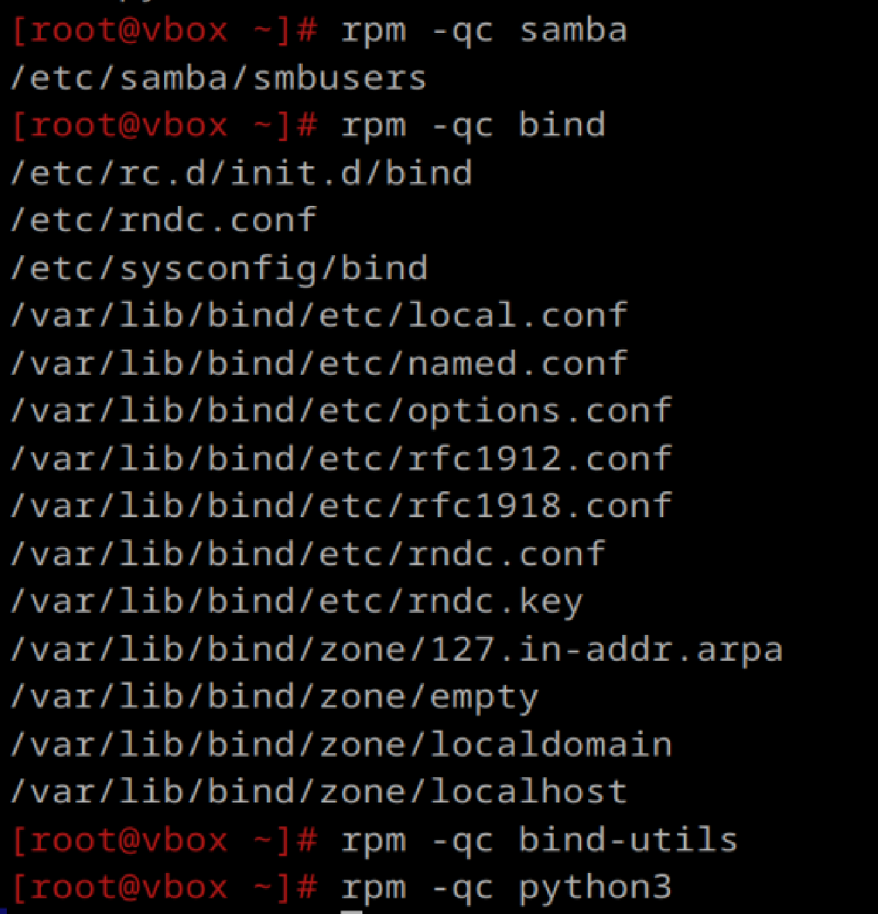
сделала все