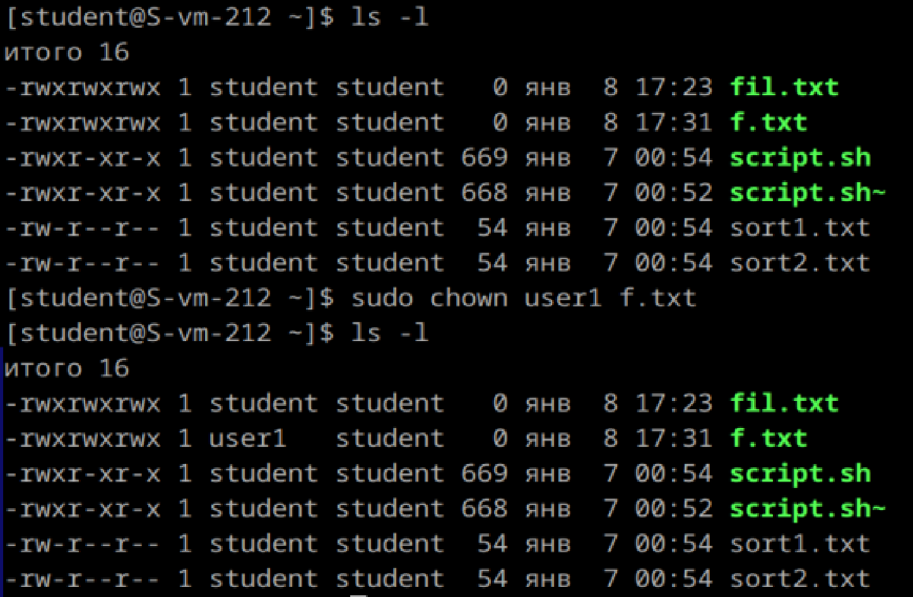

# Управление пользователями

1) Добавьте пользователей user1 и user2:
    1.1) user1 - оболочка bash
        sudo useradd -m -s /bin/bash user1

    1.2) user2 - оболочка sh
        sudo useradd -m -s /bin/sh user2

    1.3) установите им пароли
        sudo passwd user1
        sudo passwd user2

2) Назначьте пользователю 1 группу администраторов, польователя 2 добавьте в группу пользователя 1
sudo usermod -aG wheel user1
sudo usermod -aG user1 user2

3) Что такое права доступа? Выведите права доступа на файлы в директории пользователя
Это набор разрешений для пользователей на выполнение операций(чтение, запись, выполнение) с файлами или директориями.
ls -l(команда для просмотра прав доступа в директории пользователя. Я перешла в директорию home и вывела оттуда пользователей)

Перешла в директорию student и вывела его права доступа

4) Как изменить права на файлы? Создайте файл, на который у всех пользователей будут все возможные права
Изменить права на файл можно с помощью команды chmod XYZ
Цифра Права доступа Значение
0     ---           Нет прав
1     --x           Выполнение
2     -w-           Запись
3     -wx           Запись + Выполнение
4     r--           Чтение
5     r-x           Чтение + Выполнение
6     rw-           Чтение + Запись
7     rwx           Чтение + Запись + Выполнение

Каждая из цифр (X, Y, Z) задает права для:
 1. Владельца (первая цифра).
 2. Группы (вторая цифра).
 3. Прочих пользователей (третья цифра).

5) Как называется учётная запись встренного администратора в linux?
root

6) Как выполнить команду от имени администратора?
Использовать sudo или получить права суперпользователя su-

7) Есть ли ограничения у суперпользователя?
У суперпользователя практически нет ограничений, кроме ошибок в командах, которые могут привести к потере данных или повреждению системы. А так он обладает неограниченными правами в системе и может выполнять любые действия

8) Удалите пользователя 2 с помощью пользователя 1.

9) Как можно изменить владельца папки? измените владельца папки из пункта 4

сделала все