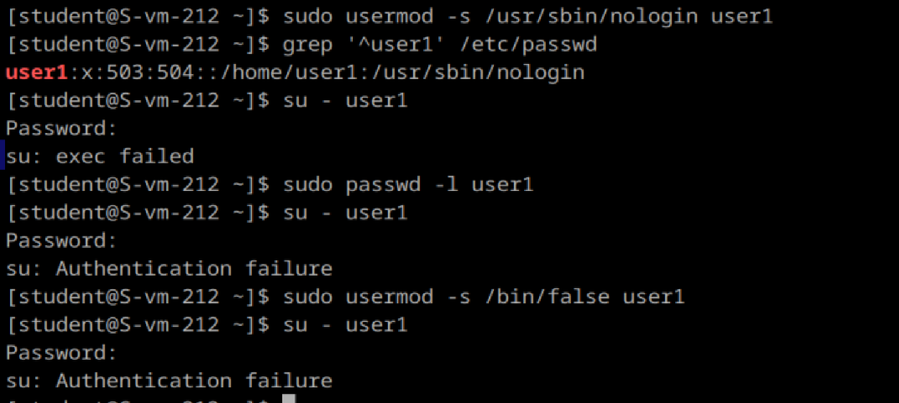

# Запрещаем

1. Запретите пользователю user1 из предыдщуего задания выполнять вход в систему

2. Как вы это сделали?
Чтобы запретить пользователю вход в систему, можно изменить его оболочку входа на специальную, такую как /usr/sbin/nologin. Это делается с помощью команды:
    sudo usermod -s /usr/sbin/nologin user1
Команда usermod с параметром -s изменяет оболочку входа для пользователя.
 Оболочка входа определяет, какие действия пользователь может выполнять после входа в систему. Установка оболочки /usr/sbin/nologin блокирует доступ к интерактивной оболочке, при этом пользователь остается активным для системных задач

3. Какие ещё способы это сделать вы знаете?
Способ 1: Заблокировать учетную запись пользователя
    sudo passwd -l user1
Это делает пароль учетной записи недействительным. Пользователь не сможет войти в систему.
Для разблокировки:
    sudo passwd -u user1
Способ 2: Отключить учетную запись пользователя
    sudo usermod -L user1
Для повторного включения учетной записи:
sudo usermod -U user1
Способ 3: Удалить оболочку пользователя
    sudo usermod -s /bin/false user1
4. Можно ли создать пользователей с одинаковыми username?
Нет, в Linux нельзя создать пользователей с одинаковыми именами (username). Система хранит информацию о пользователях в файле /etc/passwd, где каждое имя пользователя (username) должно быть уникальным. Однако создание пользователей с одинаковым UID система не запрещает, хотя это приведет к конфликтам и проблемам с безопасностью

сделала все