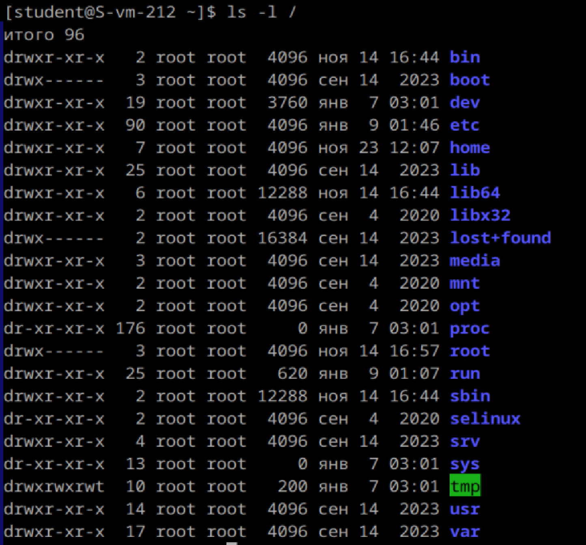

# Струтура каталогов

1) Какая структура каталогов в linux? выведите список файлов в корне системы

/ (корень) - Начало файловой системы. Все файлы и каталоги в системе находятся внутри этого корневого каталога
/bin - Содержит важные бинарные файлы (исполняемые программы), доступные всем пользователям
/boot - Файлы, необходимые для загрузки системы 
/dev - Файлы устройств. Это виртуальные файлы, представляющие физические устройства, такие как диски, USB-устройства и т. д
/etc - Конфигурационные файлы системы и служб
/home - Домашние директории пользователей
/lib - Библиотеки, необходимые для запуска программ в /bin и /sbin.
/media - Точки монтирования для съемных носителей, таких как USB-накопители и CD/DVD.
/mnt - Временные точки монтирования для файловых систем.
/opt - Дополнительные пакеты программного обеспечения.
/proc - Виртуальная файловая система с информацией о процессах и состоянии системы
 /root - Домашняя директория пользователя root.
 /run - Временные файлы, которые создаются при запуске системы 
 /sbin - Исполняемые файлы системного администрирования, доступные только администраторам 
 /srv - Данные для служб, таких как веб-серверы
 /sys - Виртуальная файловая система с информацией о системе и оборудовании
 /tmp - Временные файлы, которые очищаются при перезагрузке системы
 /usr - Пользовательские приложения, утилиты и библиотеки
 /var - Переменные данные, такие как логи, кэш, временные файлы программ.
2) Где хранятся папки пользователей в системе?
    Папки пользователей пользователей хранятся в /home

3) Где домашняя папка суперпользователя?
    Домашняя папка суперпользователя root находится в /root

4) Где хранятся основые конфигурационные файлы в системе?
    Основные конфигурационные файлы находятся в каталоге /etc

5) ЧТо за папки /bin,/sbin,usr/sbin,/usr/sbin
    /bin: Основные программы, доступные всем пользователям
    /sbin: Системные программы для управления системой. Доступ обычно ограничен администраторам.
    /usr/bin: Пользовательские утилиты и программы, установленные в системе.
    /usr/sbin: Утилиты для администрирования системы, не критичные для базовой загрузки.

сделано все