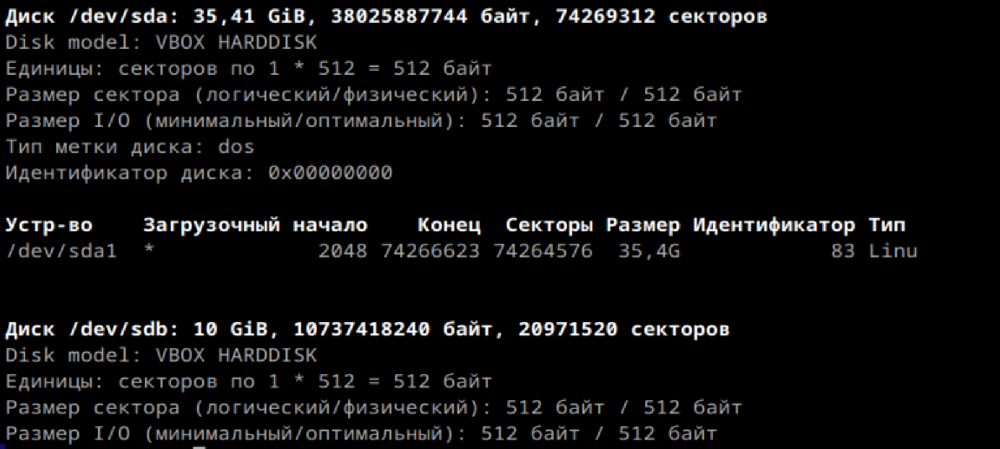

# Продолжаем

1. Выведите содержимое fstab. Что хранится в fstab?

Файл /etc/fstab содержит информацию о том, какие файловые системы и устройства монтируются при загрузке системы
Содержимое fstab включает следующее:
 • Устройство (например, /dev/sda1).
 • Точка монтирования (например, /, /home, /mnt).
 • Тип файловой системы (например, ext4, swap).
 • Опции монтирования (например, defaults, noatime).
 • Поля для управления дампом и проверкой при загрузке

2. Добавьте в виртуальную машину ещё один диск

3. Узнайте как ситема видит ваш диск - выведите информацию о блочных устройствах
fdisk -l

1ый диск тот, на котором работала всегда, а 2ой это тот, который добавила. я его на 10 ГБ сделала

вот так еще можно посмотреть

4. С помощью полученной информации создайте на диске таблицу разделов и фаловую систему ext4
Раздел:

проверка:

создался

ФС:

Проверка:

все создалось

5. Примонитруте диск в каталог /mnt

готово, с проверкой

есть

6. Зайдите в каталог и создайте там файлы

7. Отмонтируйте диск и проверье остались ли файлы

нет, не остались:(

8. Сделайте так чтобы диск автоматически подключался при загрузке систем ( добавьте информацию о нём с fstab)
изменения:
 

9. Проверьте корретность записанных в fstab данных перед перезагрузкой
сделала выше

10. Перезагрущите систему и убедитесь что диск был подключён к системе
скрин выше

сделала все