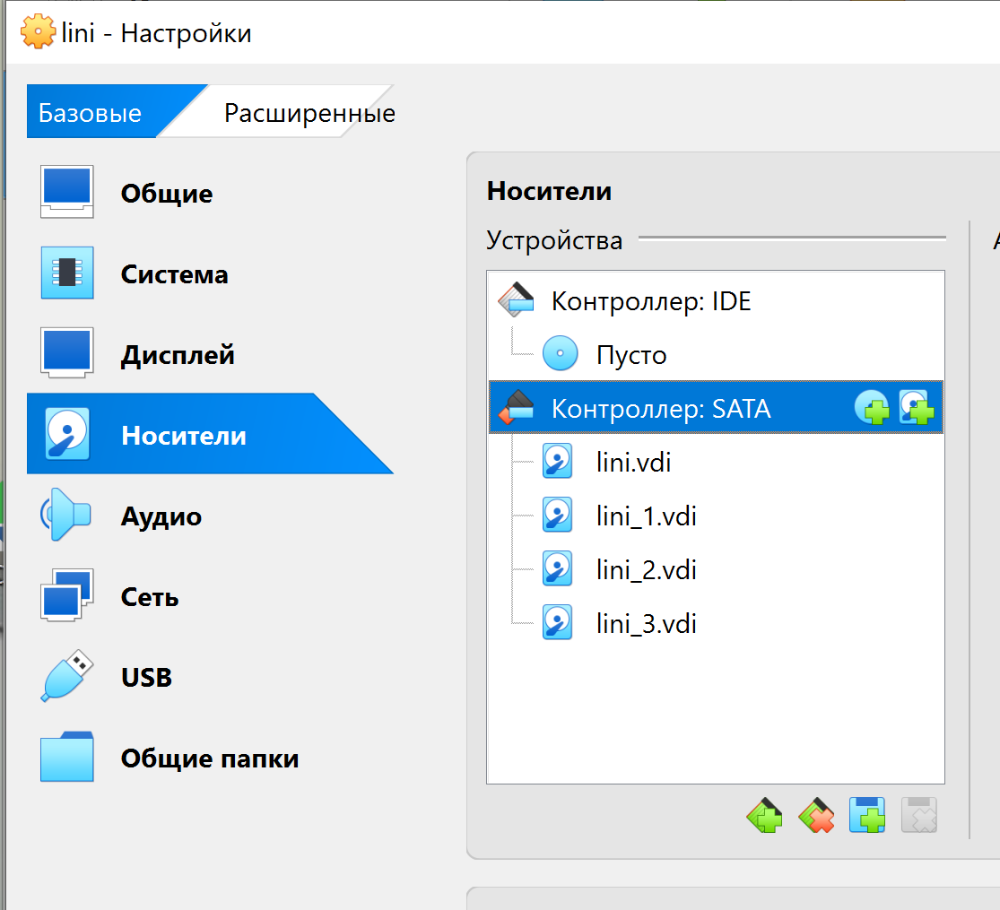
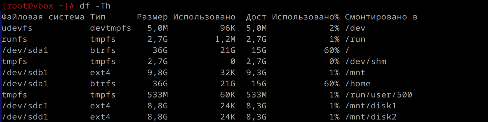
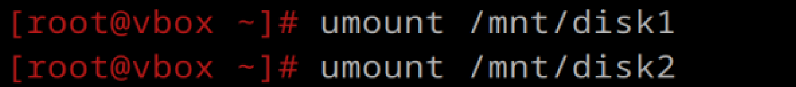
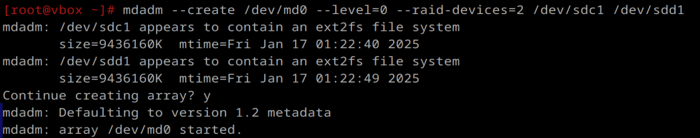
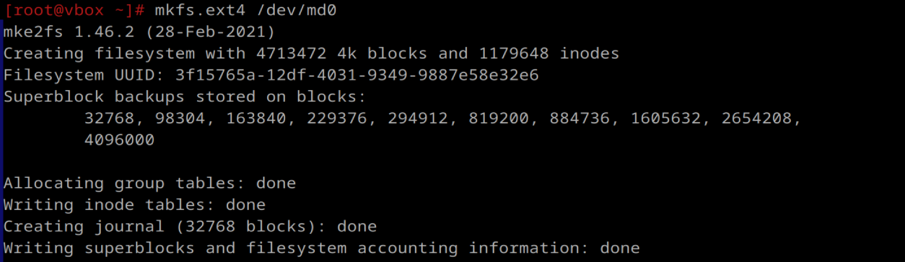
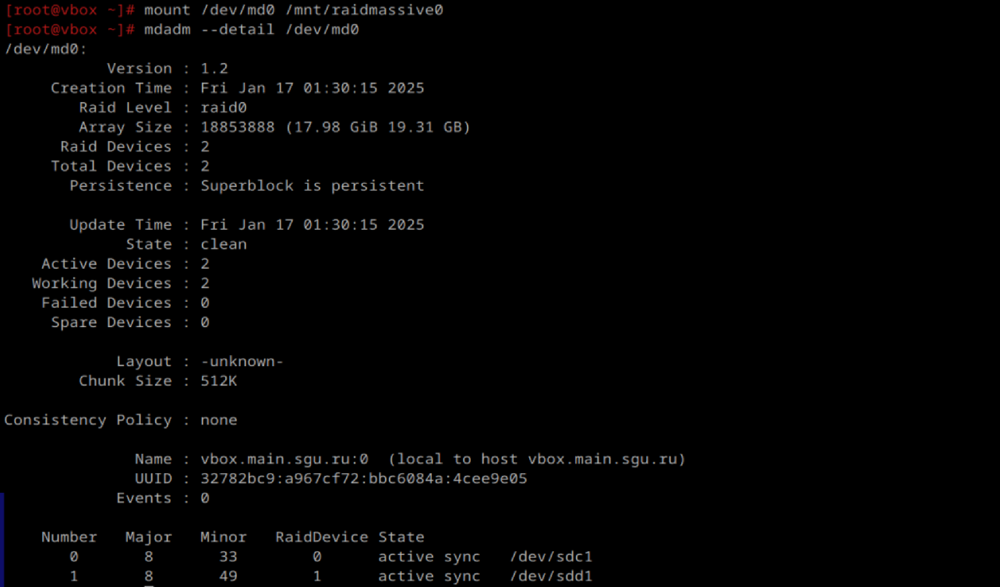
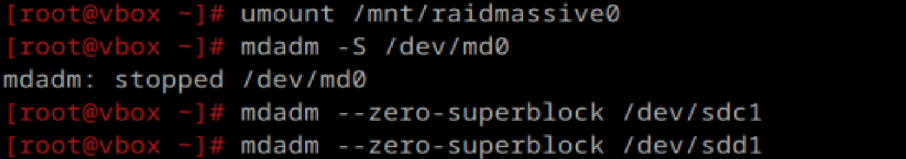
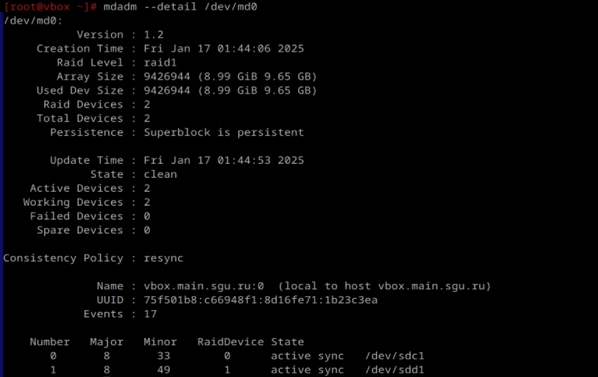

# Продолжаем

1. Raid массивы, что такое и какие бывают

RAID (Redundant Array of Independent Disks) — это технология объединения нескольких физических дисков в единый логический массив для повышения производительности, обеспечения защиты данных, баланса между ними

RAID может быть реализован:
 • Аппаратно — с использованием RAID-контроллеров
 • Программно — средствами операционной системы, например, в Linux через утилиты (mdadm и др)

Основные уровни RAID!

RAID 0 (Striping)
Данные разбиваются на блоки и записываются на несколько дисков параллельно
Преимущества:
 • Максимальная производительность (увеличение скорости чтения/записи)
 • Максимальный объем дисков доступен для хранения данных
Недостатки:
 • Нет защиты данных (отказ одного диска приводит к потере всех данных)
Применение: Системы, где важна скорость (временные данные, обработка видео)

RAID 1 (Mirroring)
Данные полностью дублируются (зеркалируются) на нескольких дисках
Преимущества:
 • Высокая надежность (данные сохраняются, если один диск выходит из строя)
 • Увеличение скорости чтения (с чтением с нескольких дисков)
Недостатки:
 • Снижение доступного объема (используется только объем одного диска)
Применение: Критически важные данные, где важна надежность (серверы, базы данных)

RAID 5 (Striping + Parity)
Данные и контрольные суммы (parity) распределяются между дисками. Для массива нужно минимум 3 диска.
Преимущества:
 • Баланс между производительностью, объемом и надежностью
 • Один диск может выйти из строя без потери данных
Недостатки:
 • Более медленная запись (из-за вычисления контрольных сумм)
 • Восстановление данных может занять длительное время
Применение: Серверы, файловые хранилища

RAID 6 (Striping + Double Parity)
То же, что RAID 5, но с дополнительной контрольной суммой. Требуется минимум 4 диска
Преимущества:
 • Выдерживает отказ двух дисков одновременно
Недостатки:
 • Более низкая производительность записи
Применение: Крупные хранилища с высокой степенью отказоустойчивости

RAID 10 (RAID 1+0)
Комбинация RAID 1 и RAID 0 (зеркалирование + распределение данных). Требуется минимум 4 диска
Преимущества:
 • Высокая производительность и надежность
Недостатки:
 • Высокие затраты на дисковое пространство (50% от общего объема)
Применение: Высоконагруженные серверы

2. Добавьте в виртуальную машину 2 диска отформатируйте их в ext4
добавила 2 новых диска и отформатировала в ext4 (sdc1, sdd1)

3. Создайте из них raid 0 массив
утилита mdadm уже установлена, создадим с помощью нее raid 0 массив, предварительно отмонтировав диски.

Отформатировала в ext4

4. Проверьте всё ли работает

Примонтируем наш рейд-массив и проверим его работоспособность:

5. Удалите raid0 и создайте raid1

Отмонтируем наш рейд-массив и очистим суперблоки 

Аналогично предыдущему шагу, создадим рейд-массив 1

6. В чём между ними разница?
 RAID 0 предназначен для повышения производительности. Тут важна скорость.
 RAID 1 направлен на обеспечение надежности. Тут важно сохранить данные.
В нашей же работе у RAID 1 размер не увеличился, тк информация на дисках дублируется, а у RAID 0 объем стал равен сумме объемов дисков

7. Есть ли файловые системы которые поддерживают raid массивы без стороненго ПО?
Да, есть такие, которые имеют встроенные возможности RAID. Например, Btrfs

8. Можно ли создать raid массив во время установки системы?
Да, RAID массив можно создать на этапе установки системы.
сделала все
