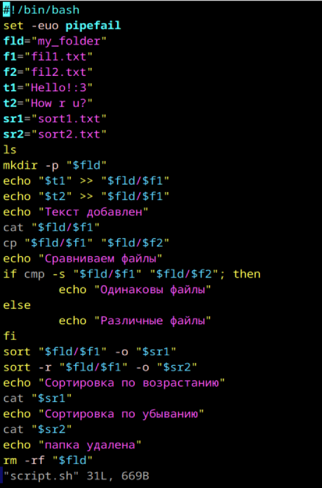

# Скриптуем по полной

1. Что такое шебанг?
Это специальная строка, которая указывается в начале скрипта и указывает интерпретатор, который должен быть использован для выполнения этого скрипта. Она начинается с символов #!, за которыми следует путь к интерпретатору.
2. Обязательно ли исполняемый файл дожен иметь соотвествующее расширение?
Нет
3. Напишите скрипт который выполнит автоматически действия из блока работы с файлами. ( не забудьте включить set -euo pipefail для того что бы ваш скрипт было удобнее отлаживать. Опишите что включают эти флаги)
-e: Прекращает выполнение, если команда завершилась с ошибкой.
-u: Прекращает выполнение, если используется необъявленная переменная.
-o pipefail: Устанавливает ненулевой статус, если любая команда в пайпе завершилась с ошибкой.

Текст, который ввела в скрипте

3 раза запускала скрипт, поэтому все строки повторяются по 3 раза
сделано все
