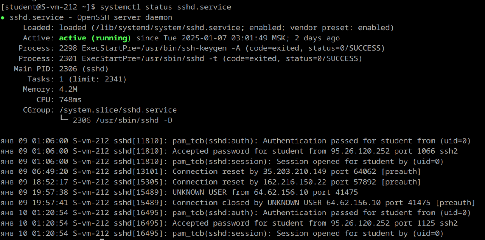

# Юниты

1. Что такое systemd юнит?
    Это базовая сущность в системе инициализации systemd, представляющая объект, которым systemd управляет. Юниты описывают услуги, задачи, процессы, точки монтирования, таймеры и многое другое.

Типы юнитов:
 • Сервис (*.service): Определяет и управляет фоновыми процессами (демонами)
 • Таймер (*.timer): Позволяет выполнять задания по расписанию (альтернатива cron)
 • Монтирование (*.mount): Описывает точки монтирования файловых систем
 • Сокет (*.socket): Управляет IPC и сетевыми сокетами
 • Точка таргета (*.target): Группирует юниты, например, для режима работы системы
 • И другие

2. Проверье статус любого systemd юнита, какую информацию выводит эта кманда?
Команда:
    systemctl status <unit_name>
Вывод этой команды содержит:
 • Состояние юнита (Active, Inactive, Failed).
 • Код завершения последнего выполнения.
 • Журнал событий юнита (из journalctl).
 • Основные параметры юнита, например, PID запущенного процесса.
 

3. ПОпробуйте оставновить сервис.
Команда:
    systemctl stop <unit_name>

4. Перезапустите его.
Команда:
    systemctl restart <unit_name>

5. УДалите из автозагрузки
Команда:
    systemctl disable <unit_name>

6. Верните обратно
Команда:
    systemctl enable <unit_name>

7. Что такое таймеры?
Таймеры в systemd — это механизм для запуска заданий по расписанию. Они являются альтернативой традиционному инструменту cron. Таймеры описываются файлами с расширением *.timer и связаны с сервисами.Они позволяют запускать службы или выполнять скрипты по расписанию или в ответ на определённые события (например, загрузка системы) и могут быть настроены на выполнение через заданные интервалы времени или в определённые моменты

Проверка состояния всех таймеров:
    systemctl list-timers

