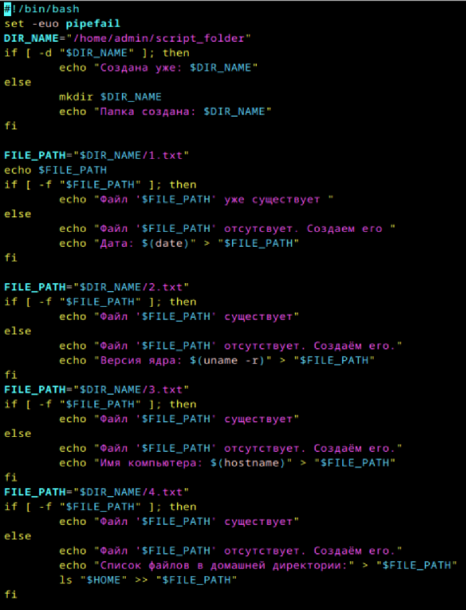

# Пишем юниты

1. Создайте скрипт который создаёт папку заполняет её файлами ( имена 1-4 ) и записывает в них информацию
о текущей дате, версии ядра, имени компьютера и списе всех файлов в домашнем каталоге пользователя от которого выполняется скрипт( не забудьте сдлеать проверку на существование файлов и папок)

 Скрипт:

2. Создайте юнит который будет вызывать этот скрипт при запуске. Проверьте
Скрипт:

Работа:

Перед этим еще написала systemctl daemon-reload

3. Создайте таймер который будет вызывать выполнение одноимённого systemd юнита каждые 5 минут.

Скрипт:

4. От какого пользователя вызыаются юниты поумолчанию?
root

5. Создайте пользователя от имени которого будет выполняться ваш скрипт.
useradd test_user

6. Дополните юнит информацией о пользователе от которого должен выплняться скрипт.
в разделе [Service] добавляем строчку User=test_user

7. Дополните ваш скрипт так, что бы он независимо от местоположения всега выполнялся в домашней папке того кто его вызывает.
Чтобы скрипт всегда выполнялся в домашней папке пользователя, нужно изменить начало скрипта
    HOME_DIR="$(eval echo "~$(whoami)")"   
    DIR_NAME="$HOME_DIR/script_folder"
    
    сделала все
