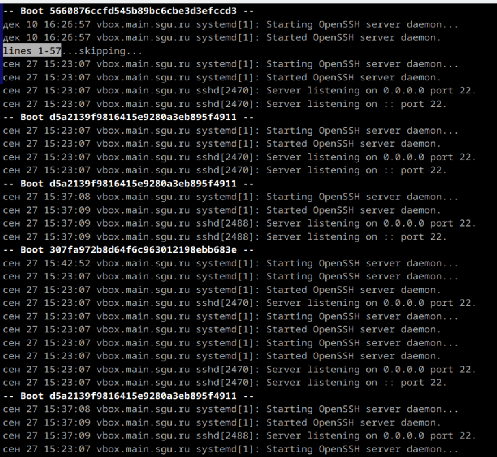
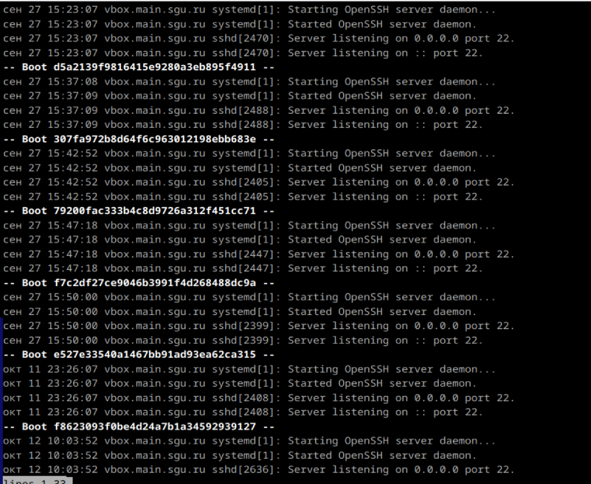
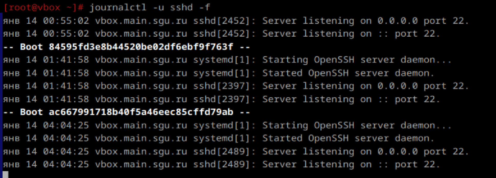

# Журнальчики

1. Посмотретите журналы ssh

2. Выведите журналы в реальном времени

3. Выведите лог в реальном времени для службы sshd

4. Можно ли без комады journalctl прочитать логи systemd?
Да, можно. используя файлы в директории /var/log
5. Сколько будет 2-2?
0