# Настриваем

1. Какой по умолчанию используется порт для поключения?
По умолчанию для подключения по SSH используется порт 22

2. Можно ли его изменить? если да то как?
да, с помощью команды :
vim /etc/openssh/sshd_config
я поменяла на 2222
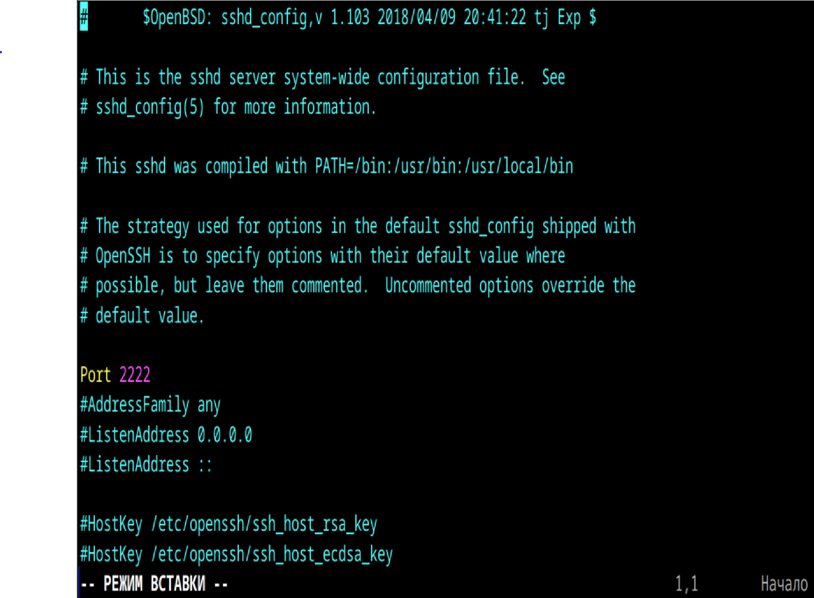
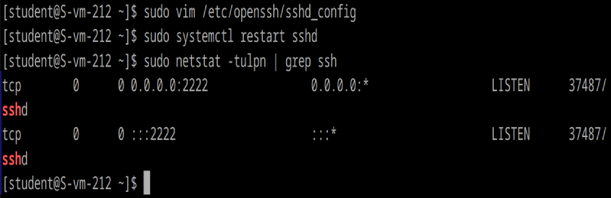

3. Какая служба отвечает за обработку запросов на подключения по ssh?
За обработку запросов на подключения по SSH отвечает служба sshd (OpenSSH Daemon)

4. Какой файл конфигурации отвечает за его настройку?
Основной файл конфигурации SSH-сервера — это:
/etc/ssh/sshd_config
выше находила его

5. Попробуйте подключиться по ssh к предоставленному вам серверу
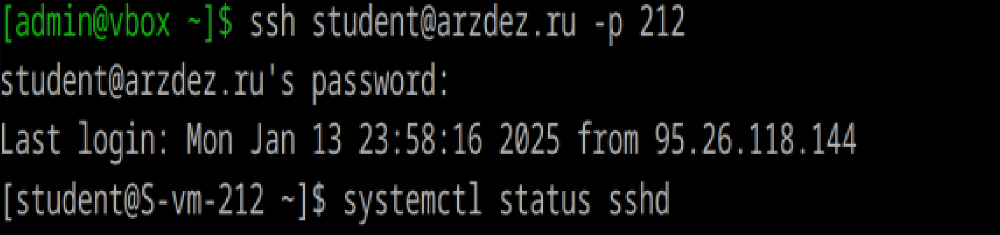
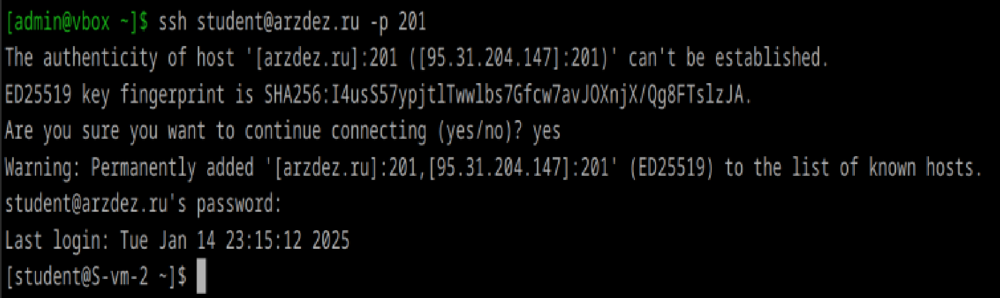

6. Отредактируйте файл настроек на сервере так, чтобы была возможность подключиться к серверу используя пользователя root

Откроем файл конфигурации:
sudo vim /etc/ssh/sshd_config
Ищем строку:
PermitRootLogin
Напротив нее ставим yes
и
sudo systemctl restart sshd
Теперь могу подключаться по SSH с использованием пользователя root.

7. Измените колличество ошибок ввода пароля перед сборосом соединения, покажите эти измененения
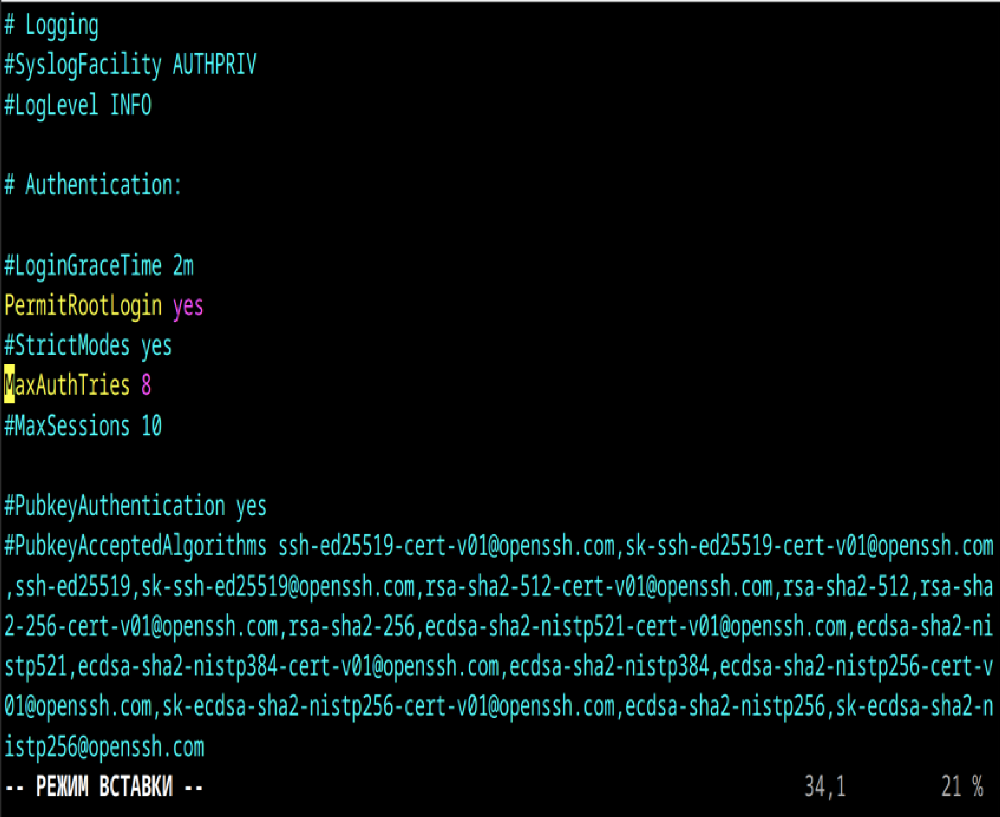
Откроем файл конфигурации:
sudo vim /etc/ssh/sshd_config
Ищем строку:
MaxAuthTries
Напротив нее ставим число
и
sudo systemctl restart sshd
При превышении заданного количества попыток соединение будет сброшено.

8. Создайте пользователя ssh-user и попробуйте им подключиться к серверу
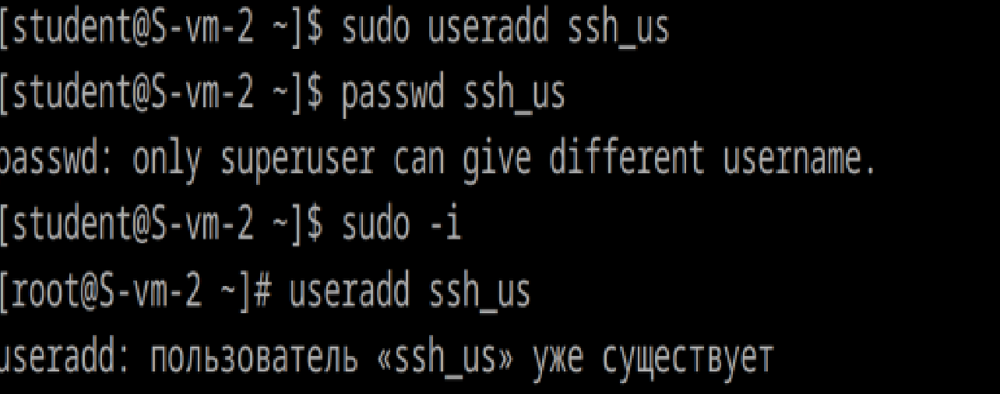
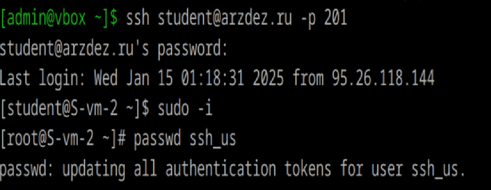
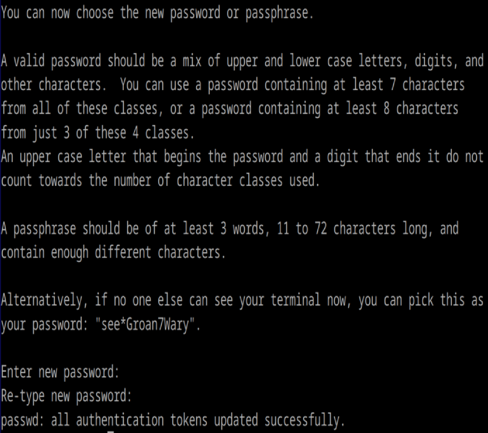
создала пользователя и установила пароль
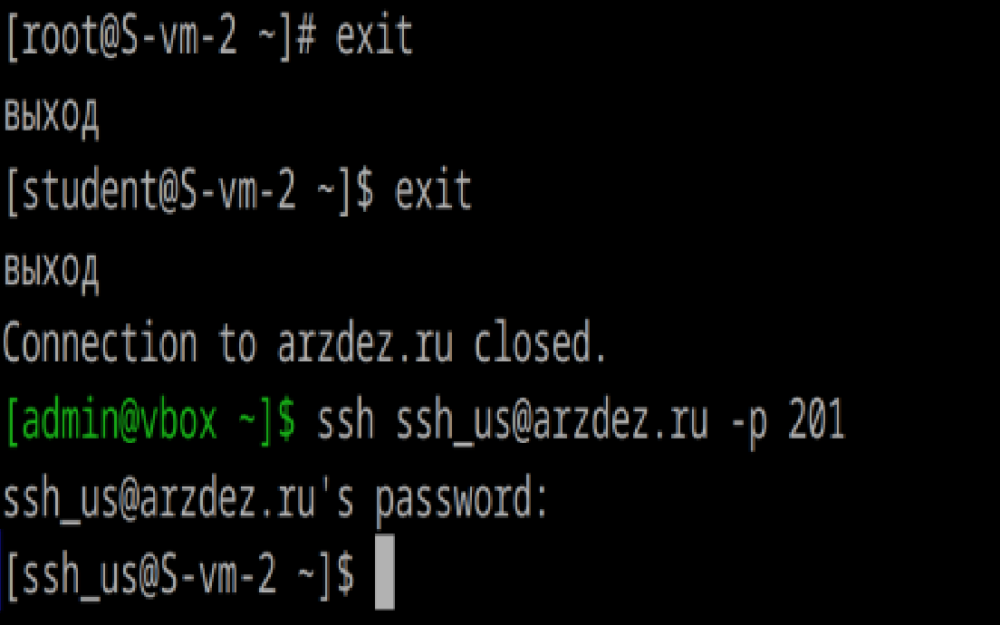
вошла в него

9. Ограничте ему возможность подключения к серверу
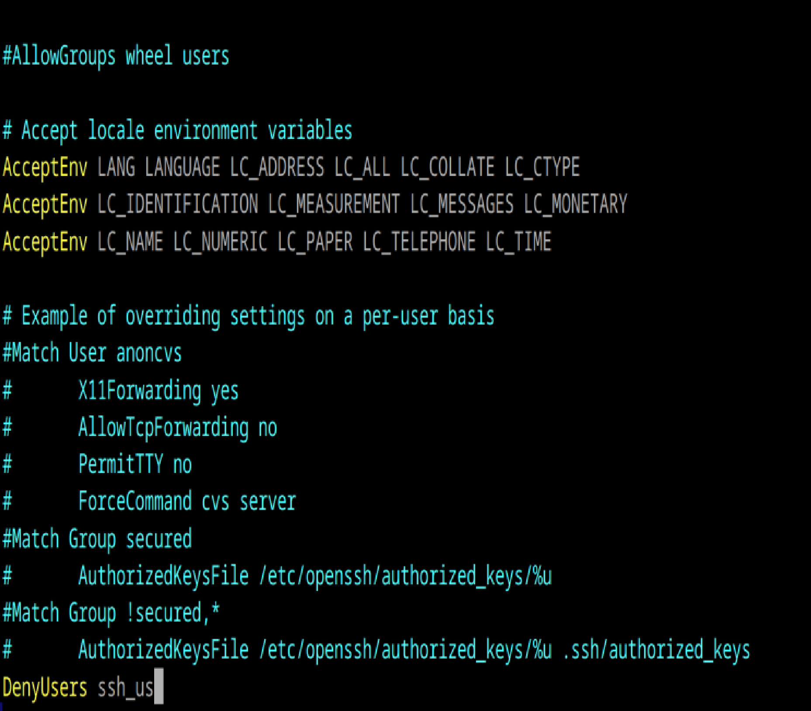
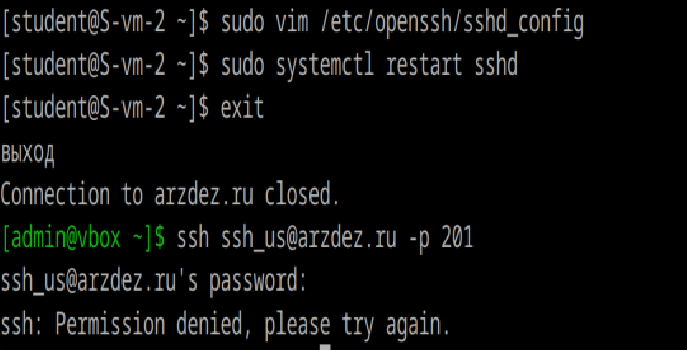
10. Как вы это сделали?
Откроем файл конфигурации:
sudo vim /etc/ssh/sshd_config
Пишем строку:
DenyUsers ssh_us
и
sudo systemctl restart sshd

11. Что хранится в файле known_hosts?
Файл known_hosts хранит открытые ключи серверов, к которым ранее подключались через SSH. Это используется для проверки подлинности сервера при следующих подключениях. 
Каждая строка в файле содержит запись для одного сервера. Запись включает:
 1. Хост (IP-адрес или доменное имя)
 2. Тип ключа
 3. Открытый ключ сервера