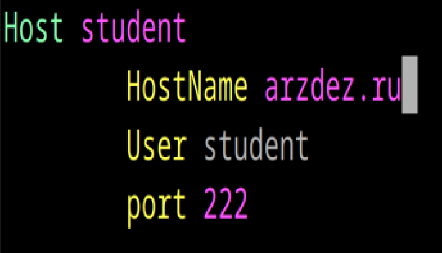
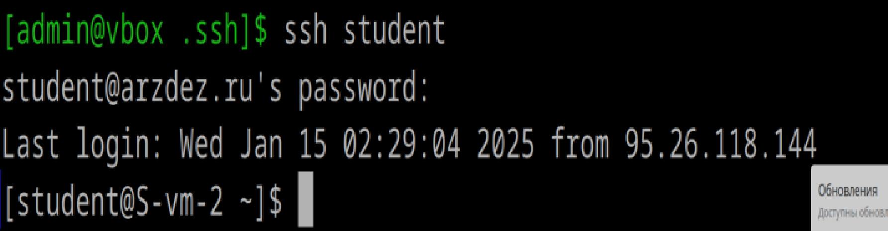

# Конфижим для удобства

1. Где хранятся пользвательские и системные настройки подключения?
Пользовательские настройки: файл ~/.ssh/config (в домашней директории пользователя).
файл ~/.ssh/authorized_keys содержит список публичных ключей
Системные настройки: глобальный файл /etc/openssh/ssh_config (общие для всех пользователей)
фаил /etc/openssh/sshd_config(SSH и его поведение)

2. Что за файл options?
Файл options в Linux — это файл конфигурации, который содержит параметры и настройки для различных компонентов операционной системы. В нём указывают процессы, группы пользователей, права доступа, доступ к сети и протоколы
Для SSH файл ~/.ssh/config можно воспринимать как файл конфигурации “options”. 

3. Отредактируйте файл options так, чтобы можно было подключаться не вводя имя пользвателя и порт
4. Назовите подключение удобным для вас спсобом
5. Проверьте работоспособность
пишем в vim ~/.ssh/config

cделала все

