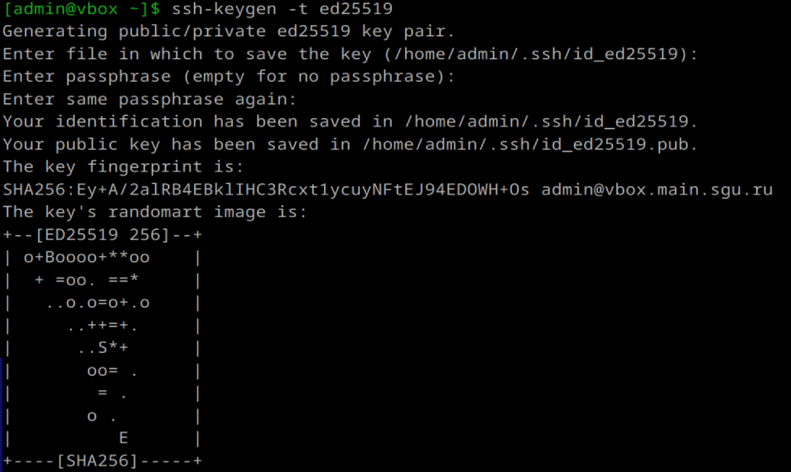
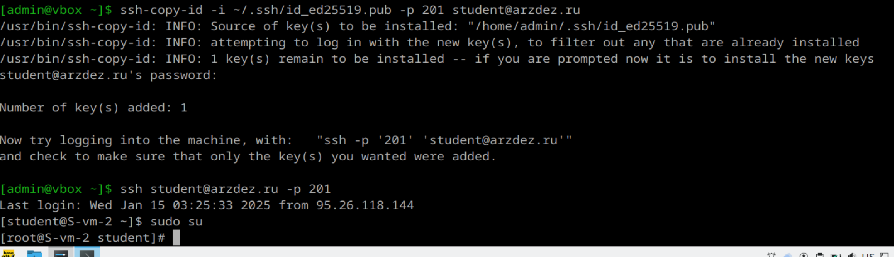
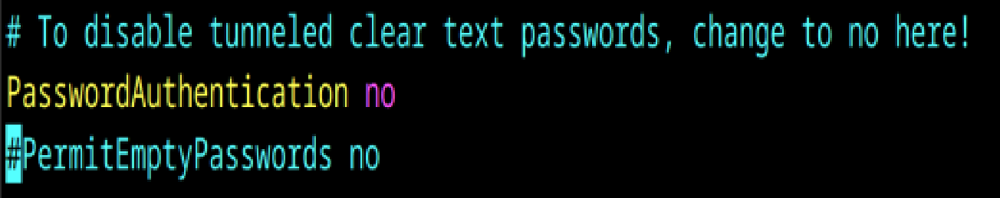

# Ключики

1. Что такое ssh ключи и зачем они нужны?
SSH-ключи — это пара криптографических ключей (публичный и приватный), которые используются для аутентификации при подключении к серверу через протокол SSH (Secure Shell). Они заменяют пароли, обеспечивая более безопасный и удобный способ доступа.
Один ключ можно использовать для доступа к нескольким серверам. Приватный ключ (Private Key) хранится в скрытом виде, открытый ключ (Public Key) передаётся другим устройствам или пользователям

2. Как их создать? 
Для создания используется команда ssh-keygen

ssh-keygen -t ed25519 -C "ваш_email@example.com"
где -t ed25519 — тип ключа, -C — комментарий

3. Создайт пару публичный/приватный ключ ed_25519, где они хранятся?

путь по умолчанию, пароль не делала

4. Скопируйте публичный ключ на ваш сервер, в каком файле он будет храниться?
Для копирования используется команда ssh-copy-id:

Публичный ключ добавляется в файл сервера ~/.ssh/authorized_keys

5. Попробуйте подключиться к серверу, у вас запросили пароль?
нет

6. Запретите подключение с паролем для всех пользователей, оставьте только с помощью ключа.

PasswordAuthentication исправила на "no"
сделаал все