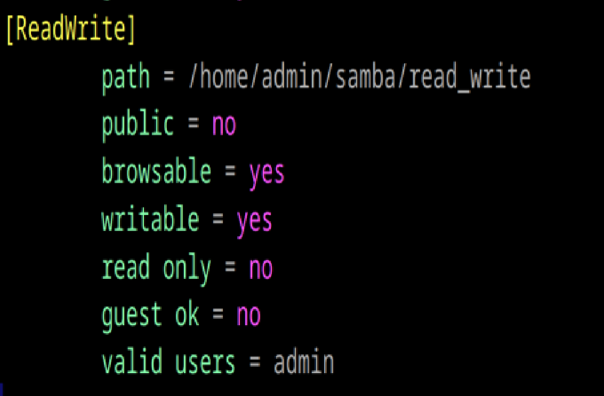

# Шарим

1. Установите пакет samba
Samba — это программный пакет, который позволяет организовать совместный доступ к файлам и принтерам между операционными системами Windows и Linux.

Для установки Samba выполните следующую команды(обновление пакетов и установка):

apt-get install samba

запуск
systemctl enable smb.service nmb.service

2. ЧТо такое побщая папка, зачем оно может быть нужно?
Общая папка — это папка, доступ к которой предоставляется нескольким пользователям (локально или по сети). Она позволяет обмениваться файлами, работать с документами совместно или предоставлять общий доступ к данным, централизация данных

3. Создайте общую папку без пароля с правами только на чтение файлов
Создание папки:
mkdir /home/admin/samba/read_only
chmod 555 /home/admin/samba/read_only

Настроем общий доступ в конфигурационном файле Samba:
vim /etc/samba/smb.conf

Добавим в конец файла:
[ReadOnly]
   path = /home/admin/samba/read_only
   public = yes
   browseable = yes
   writable = no
   read only = yes
   guest ok = yes

Перезапуск
systemctl restart smb.service nmb.service
Теперь папка доступна всем без пароля, но только для чтения

видно, что я не могу создать 
кнопка "создать" серым цветом и на нее нельзя нажать

4. Создайте общую папку с паролем с правами на чтение и запись
Создание папки:
mkdir /home/admin/samba/read_write
chmod 555 /home/admin/samba/read_write

Создание пользователя:
smbpasswd -a admin

установила еще это, тк не было команды выше в доступе:
apt-get install samba-client 

Общий доступ в smb.conf:
[ReadWrite]
   path = /home/admin/samba/read_write
   public = no
   browsable = yes
   writable = yes
   read only = no
   guest ok = no
   valid users = admin

Перезапуск:
systemctl restart smb.service nmb.service
Теперь только авторизованные пользователи смогут читать и записывать файлы.
была под admin, поэтому без пароля и логина зашла в папку, тк уже авторизована

5. 6. Создайте общую папку в которой у одной группы будет полный доступ, а у другой только доступ на чтение.
Третья группа не должна иметь к ней доступа
Cоздаем три группы:

groupadd full_access
groupadd read_only
groupadd no_access

Создаем пользователей:
useradd useracc
useradd userread
useradd userno

usermod -aG full_access useracc
usermod -aG read_only userread
usermod -aG no_access userno

smbpasswd -a user1
smbpasswd -a user2
smbpasswd -a user3

Папка:
mkdir /home/admin/samba/multi
chmod 777 /home/admin/samba/multi

общий доступ в smb.conf:

[MultiAccess]
   path = /home/admin/samba/multi
   valid users = @full_access, @read_only
   public = no
   browsable = yes
   guest ok = no
   read only = no
   writable = yes
   write list = @full_access
   read list = @full_access, @read_only

Перезапуск:
systemctl restart smb.service nmb.service

Теперь:
 • Группа full_access имеет полный доступ.
 • Группа read_only может только читать файлы.
 • Группа no_access не имеет доступа.

