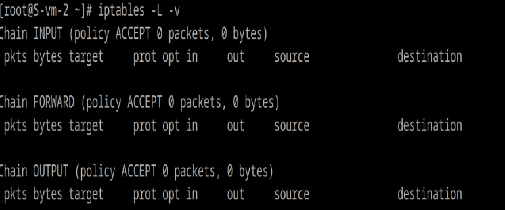

# Открываем iptables

1. Установите iptables
apt-get install iptables 

2. Проверьте осталась ли возможность подключения по ssh к вашему серверу
iptables -L -v

3. Почему может пропасть такая возможность?
Если в iptables настроено правило, блокирующее порт 22 (по умолчанию используется SSH), то соединение станет невозможным.

4. Откройте нужный порт на сервере чтобы восстановить подключение
iptables -A INPUT -p tcp --dport 22 -j ACCEPT

5. Это будет udp или tcp прот?
SSH использует TCP протокол, поскольку он обеспечивает надежное соединение с контролем ошибок

# Сохраняем

6. Сохраняются ли записанные вами правила после перезагрузки?
Нет, правила iptables по умолчанию не сохраняются после перезагрузки. После перезапуска сервера все изменения сбрасываются

7. Как их сохранить?

Сохранить текущие правила в файл:
iptables-save > /etc/iptables/rules.v4

Восстановить правила из файла:
 iptables-restore < /etc/iptables/rules.v4

Проверка, что файл восстанавливается при перезагрузке:
vim /etc/systemd/system/iptables.service
Содержимое:
[Unit]
    Description=Restore iptables rules
    After=network.target

[Service]
    ExecStart=/sbin/iptables-restore < /etc/iptables/rules.v4
    ExecReload=/sbin/iptables-restore < /etc/iptables/rules.v4
    RemainAfterExit=yes

[Install]
    WantedBy=multi-user.target

systemctl enable iptables
systemctl start iptables

Теперь правила сохраняются и восстанавливаются автоматически.

При работе с firewall не рекомендую отключаться от текущей сессии ssh. Лучше подключаться из другой консольки.
сделала все!