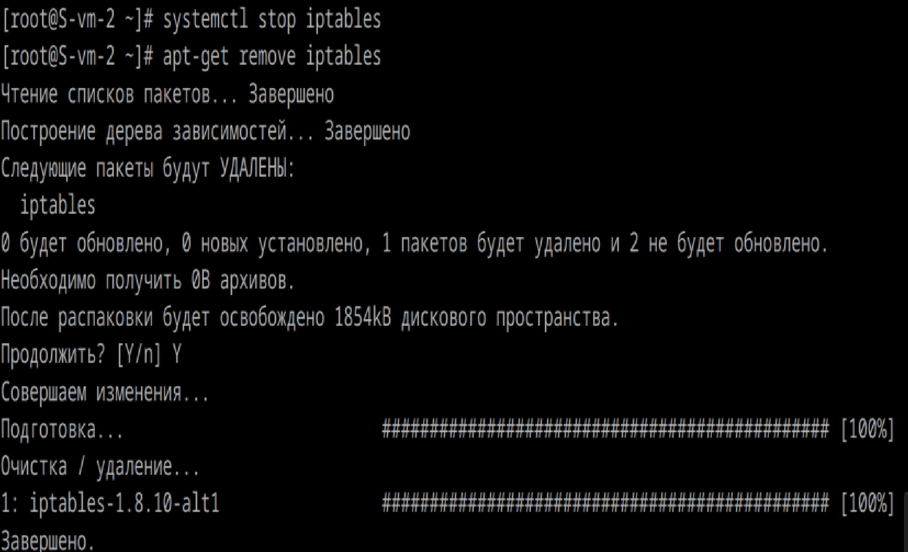
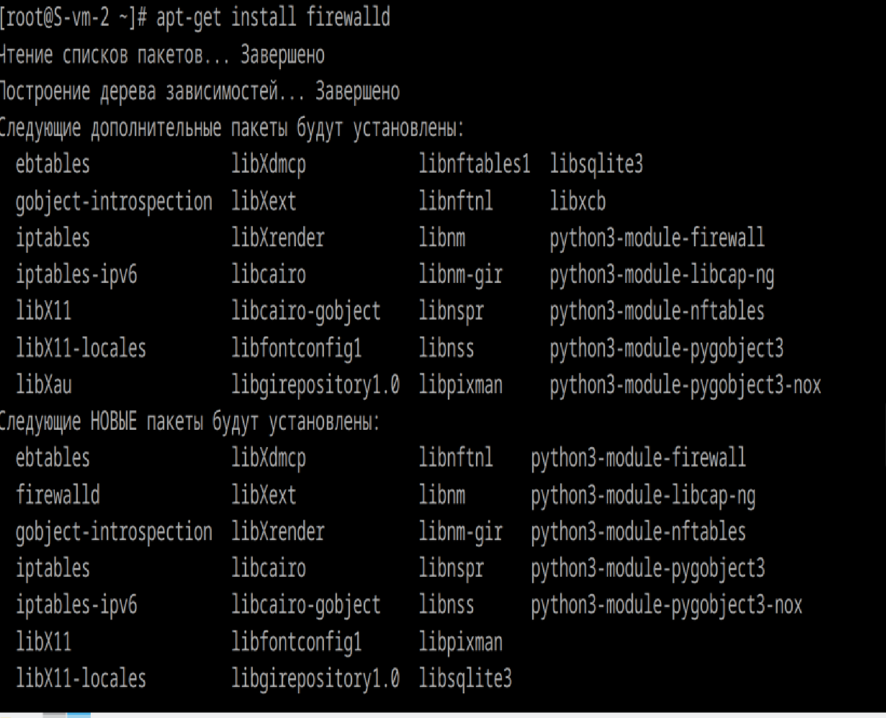
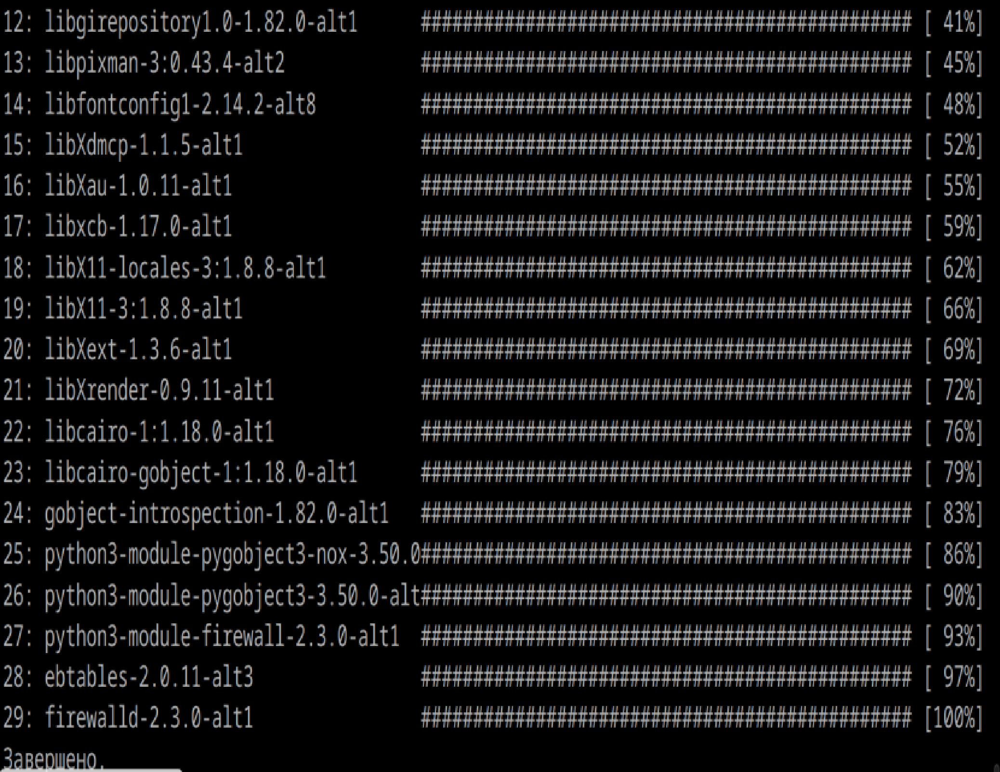
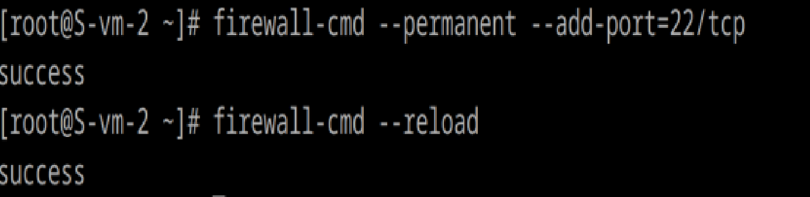
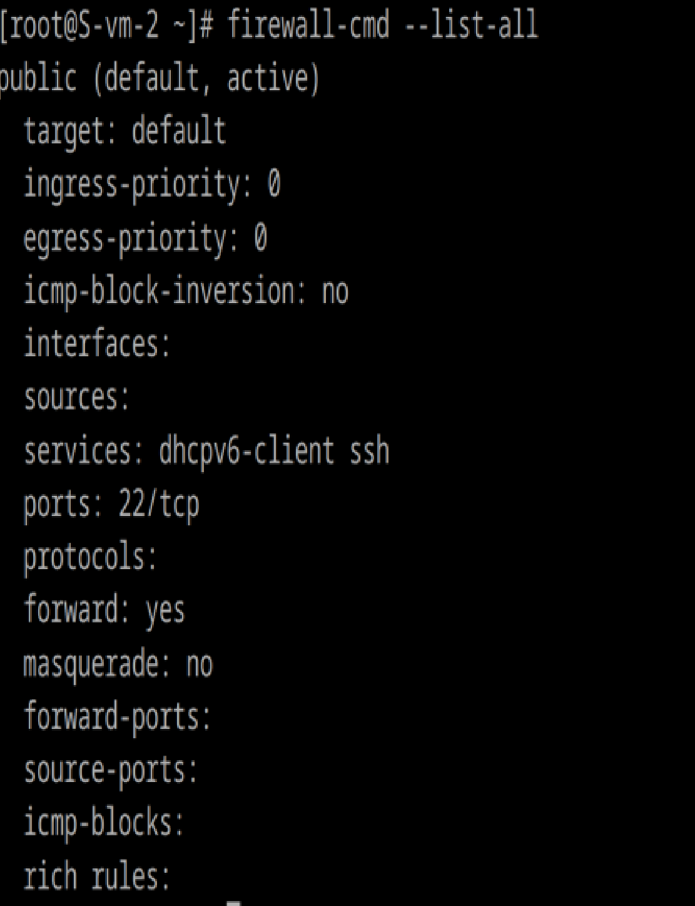
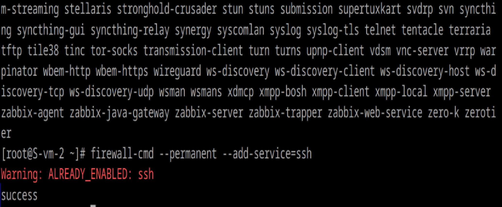
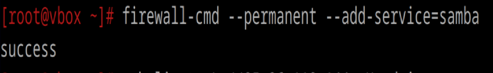
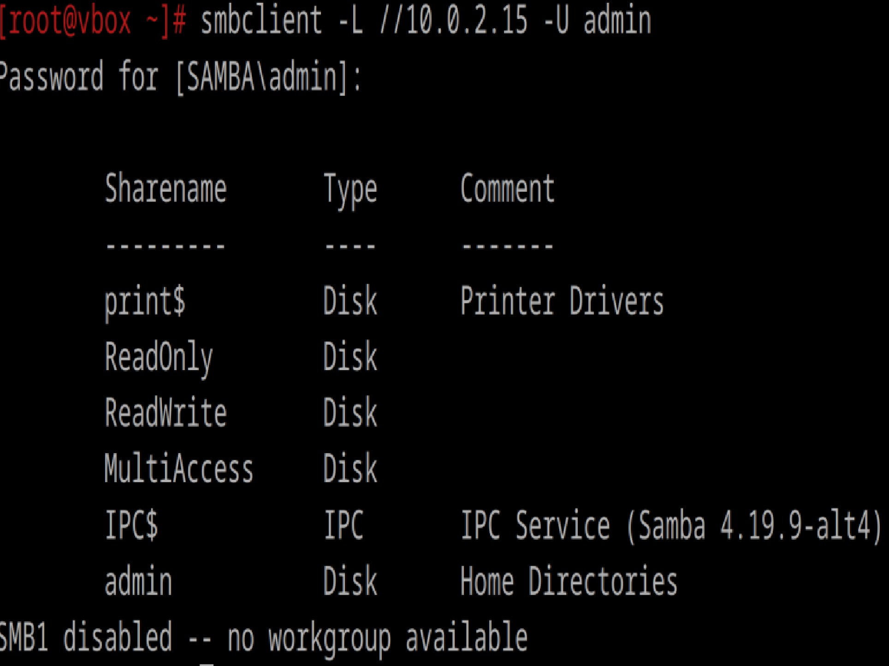

# Открываем firewald

1. Удалите iptables и установите firewalld
systemctl stop iptables
apt-get remove iptables

apt-get install firewalld

systemctl start firewalld
systemctl enable firewalld

firewalld запущен:
systemctl status firewalld

2. Попробуйте так-же проверить возможность подключения по ssh
Могу зайти

3. Если её нет то откройте порт
firewall-cmd --permanent --add-port=22/tcp
firewall-cmd --reload

4. Выведите список открытых портов с помощью firewall-cmd
firewall-cmd --list-all

5. Можно ли там добавить порты по названию сервиса?
Все порты
firewall-cmd --get-services

Да, вместо портов можно добавлять сервисы
firewall-cmd --permanent --add-service=ssh
firewall-cmd --reload

уже добавлен, поэтому так

6. На вашей Локальной виртуальной машине попробуйте подключиться к серверу samba из предыдущих заданий

7. Если не получилось то откройте нужные порты
sudo firewall-cmd --permanent --add-service=samba
sudo firewall-cmd --reload

У меня сначала не заходилось, тк перепутала порты, потом я добавила самбу, и потом смогла зайти.
9. Сделайте так чтобы изменения были постоянными
firewall-cmd --runtime-to-permanent

