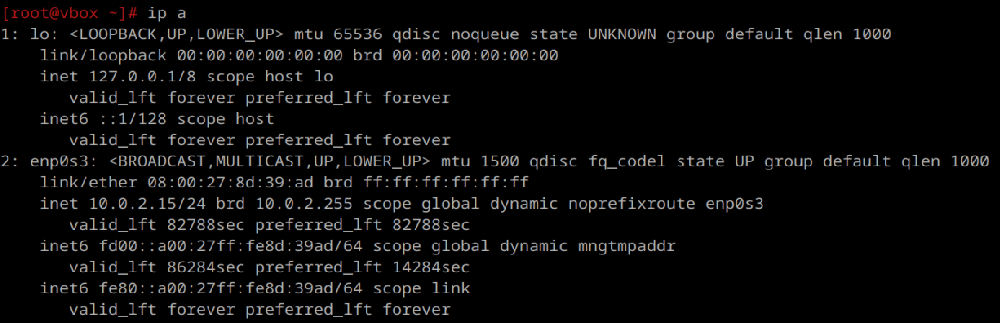
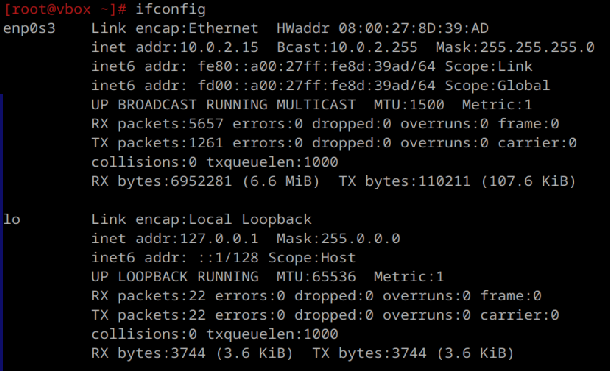
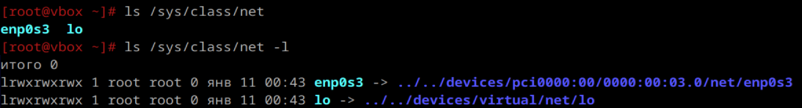
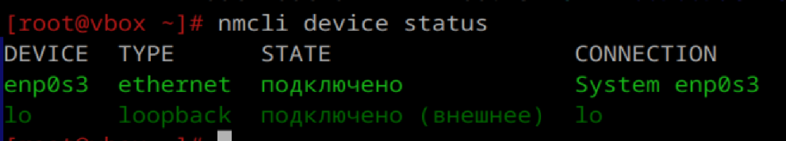
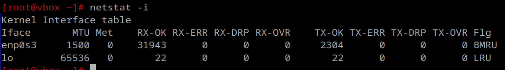
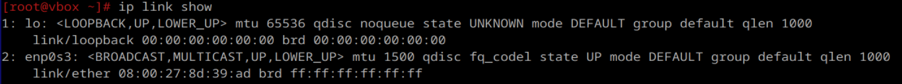
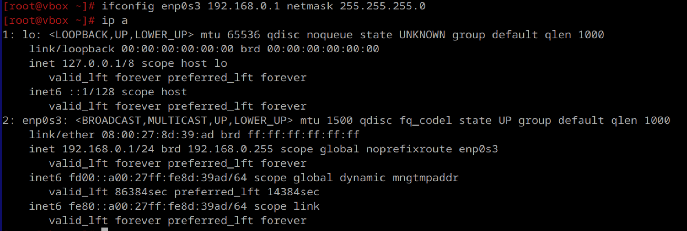
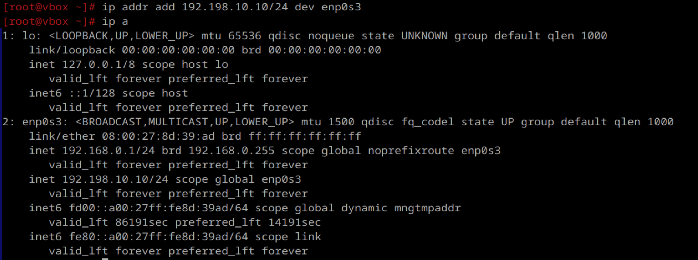
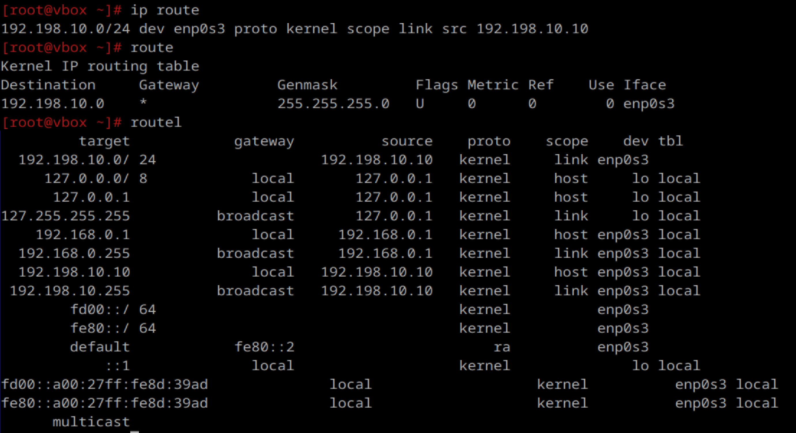
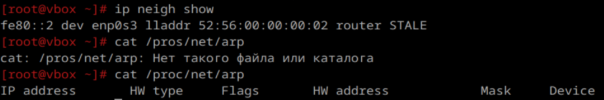

# сети

1. Выведите список интерфейсов, какими способами можно это сделать?
ip a – выводит подробную информацию об интерфейсах, включая IP-адреса

ifconfig- устаревшая команда

ls /sys/class/net – выводит список доступных интерфейсов

nmcli device status – список интерфейсов с помощью NetworkManager

netstat -i

ip link show

2. Попробуйте изменить ip адрес

3. Попробуте добавить несколько ip адресов на сетевую карту

4. Выведите список маршрутов

5. Выведите arp таблицу

6. Что такое ip адрес?
IP-адрес (Internet Protocol Address) – это уникальный идентификатор устройства в сети. Используется для взаимодействия устройств в локальных и глобальных сетях
Типы IP-адресов:
    IPv4: Представляет собой 32-битное число. Может содержать около 4.3 млрд уникальных адресов.
    IPv6: Использует 128-битное представление.Решает проблему нехватки адресов, так как предоставляет более 340 ундециллионов адресов

7. Для чего нужны маршруты?
Маршруты определяют, как пакеты данных передаются от источника к получателю. Они указывают, через какой интерфейс или шлюз нужно отправить трафик для достижения конкретной сети. Когда компьютеру нужно отправить пакет в сеть, он смотрит таблицу маршрутизации, в ней указаны IP-адреса пунктов назначения и адреса интерфейсов и роутеров в домашней сети, которые могут отправить пакет по нужному адресу. Если для цели маршрут не указан, то используется так называемый шлюз по умолчанию или маршрут по умолчанию.
Шлюз по умолчанию – адрес устройства, через которое осуществляется доступ к внешним сетям
Сетевой интерфейс – интерфейс, через который передаются пакеты

8. Что за протокол arp?
ARP (Address Resolution Protocol) – сетевой протокол, работающий на уровне канала данных. Используется для сопоставления IP-адресов (логический адрес) с MAC-адресами (физический адрес).Работает только в пределах одной локальной сети. Когда устройство в сети хочет отправить данные, оно сначала должно найти физический адрес сетевого адаптера получателя. Для этого используется ARP-запрос, рассылка которого осуществляется через широковещательные сообщения. Этот запрос содержит IP-адрес целевого устройства и направляется ко всем узлам в локальной сети. Узел, распознавший свой IP в запросе, отвечает с указанием своего MAC-адреса. Таким образом, исходное устройство получает необходимую информацию для установления прямого взаимодействия

9. Что такое dhcp?
DHCP(Dynamic Host Configuration Protocol) – это протокол, который автоматически назначает сетевые параметры устройствам в сети.
Он Назначает IP-адрес, указывает маску подсети, предоставляет шлюз по умолчанию, настраивает DNS-сервер.
Работа DHCP:
1 Новое устройство подключается к сети.
2 Оно отправляет запрос “DHCP DISCOVER” всем устройствам в сети (широковещательный запрос).
3 Сервер DHCP отвечает, назначая параметры.
Протокол управляет пулом доступных IP-адресов и следит за тем, чтобы один и тот же адрес не был назначен нескольким устройствам одновременно. Это предотвращает конфликты адресов в сети.

10. Что такое dns?
DNS(Domain Name System) – это система, которая переводит понятные человеку доменные имена (например, google.com) в IP-адреса (например, 142.250.74.14). DNS состоит из множества DNS-серверов по всему миру, каждый из которых хранит информацию о доменных именах и соответствующих им IP-адресах. Это обеспечивает надёжность и масштабируемость DNS в рамках интернета. Без DNS невозможна работа сайтов, приложений, мессенджеров, электронной почты, VPN, компьютерных игр, интернета вещей и других сервисов

11. Как называется один из протоколов синхронизации времени?
NTP (Network Time Protocol) используется для синхронизации системного времени на устройствах. Работает по модели клиент-сервер. Обеспечивает точность до миллисекунд.

12. Что такое широковещательный запрос, зачем он нужен?
Широковещательный запрос — это отправка пакета всем устройствам в сети. Для реализации такой рассылки назначается специальный широковещательный адрес. Когда хосту нужна информация, он отправляет запрос на широковещательный адрес. Все остальные хосты в сети получат и обработают этот запрос. Один или несколько хостов вложат запрашиваемую информацию и ответят на запрос

13. Какой адресс является широковещательным?
Широковещательным является адрес, который используется для получения данных всеми компьютерами в сети(FF:FF:FF:FF:FF:FF)

14. Какие ещё параметры можно задать сетевой карте?
Сетевой карте можно задать:
    - IP адрес;
    - Маску подсети;
    - Шлюз по умолчанию;
    - DNS-серверы;
    - MAC-адрес;
    - максимальный размер пакета MTU.

15. Что такое маска подсети? зачем она нужна?
Маска подсети – это число, определяющее, какая часть IP-адреса отвечает за сеть, а какая – за хост
Пример:
 IP: 192.168.1.1
Маска: 255.255.255.0 .
Это значит:
Сеть: 192.168.1.0.
Диапазон хостов: 192.168.1.1 - 192.168.1.254.
Широковещательный адрес: 192.168.1.255.
Маска определяет границы локальной сети. Устройства с одинаковой маской и IP-адресами в пределах одной сети могут взаимодействовать напрямую.
cделаал все

